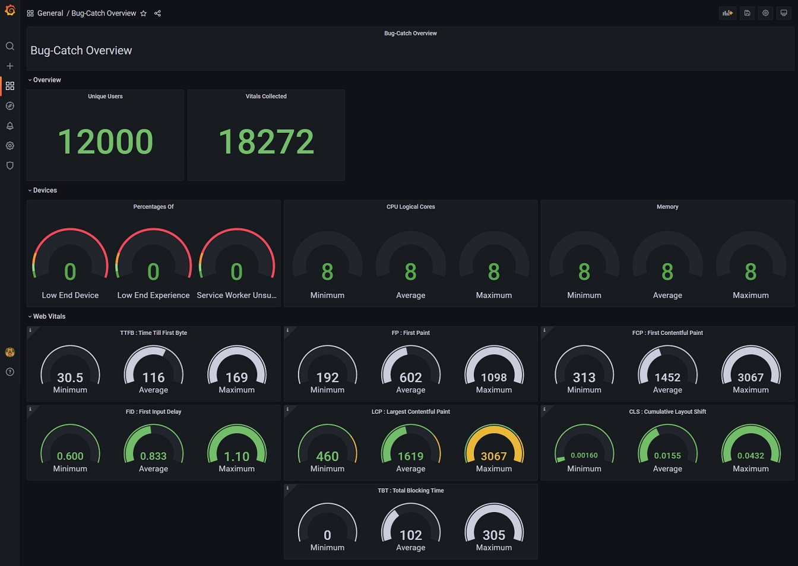

# Bug Catch & [Grafana](https://grafana.com/)

A **grafana** layout to display bug-catch data.

## Screenshot



## Get Setup

### Grafana Plugins

Since the bug-catch API returns JSON, this layout requires the [`marcusolsson-json-datasource`](https://marcus.se.net/grafana-json-datasource/installation) grafana plugin:

```
grafana-cli plugins install marcusolsson-json-datasource
```

If you are using the grafana Docker image, you can install gafana plugins using `GF_INSTALL_PLUGINS` ENV:

```
GF_INSTALL_PLUGINS=marcusolsson-json-datasource
```

### Add bug-catch to Grafana as a new datasource

1. Data sources -> Add data source

2. Use the `JSON API` datasource (this is the plugin we installed earlier)

3. Set the URL to the bug-catch endpoint on your API e.g, `https://example.com/api/v1/bug-catch`

4. Add a `Custom HTTP Headers`. Header = `authorization` Value = `YOUR_BUG_CATCH_TOKEN`

5. That's it! - `Save & Test`

### Import bug-catch layout to Grafana

1. Create -> Import

2. Copy/Paste the `grafana-bugcatch.json` file
