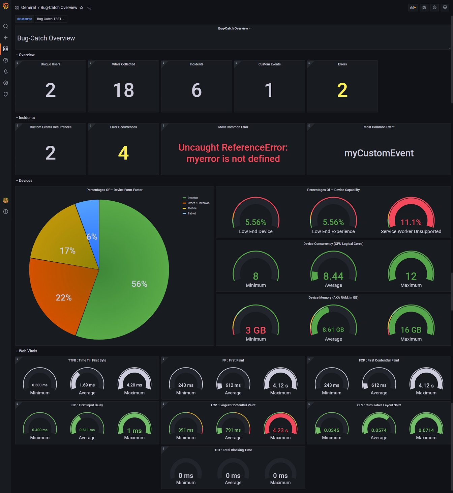

# Bug Catch & [Grafana](https://grafana.com/)

A **grafana** layout to display bug-catch data.

## Screenshot



## Get Setup

Since the bug-catch API returns JSON, this layout requires the [`marcusolsson-json-datasource`](https://marcus.se.net/grafana-json-datasource/installation) grafana plugin:

```
grafana-cli plugins install marcusolsson-json-datasource
```

If you are using the grafana Docker image, you can install gafana plugins using `GF_INSTALL_PLUGINS` ENV:

```
GF_INSTALL_PLUGINS=marcusolsson-json-datasource
```
